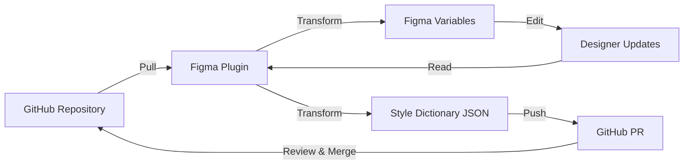

# Figma Token Sync - Project Summary

**Status:** ✅ Production Ready

## Overview

Figma Token Sync is a complete bidirectional sync plugin between Figma Variables and GitHub-hosted Style Dictionary tokens. It enables design teams to manage design tokens with version control, code review, and automated workflows.

## Core Features

### ✅ Implemented (Production Ready)

1. **GitHub Integration**
   - Full GitHub API integration with authentication
   - Repository and branch validation
   - Personal Access Token authentication
   - Rate limit handling
   - Comprehensive error messages

2. **Configuration Management**
   - Persistent settings storage
   - Connection testing with detailed feedback
   - Token file path discovery (glob patterns)
   - Per-user isolated storage

3. **Pull Flow (GitHub → Figma)**
   - Fetches Style Dictionary JSON tokens from GitHub
   - Automatic variable collection creation
   - Variable creation and updates
   - Type mapping (COLOR, FLOAT, STRING, BOOLEAN)
   - Color parsing (hex, rgb, rgba)
   - Dimension parsing (px, rem, em)
   - Progress feedback during sync

4. **Push Flow (Figma → GitHub)**
   - Reads all Figma variable collections
   - Transforms to Style Dictionary JSON
   - Creates collection-specific files
   - Automatic changelog generation
   - Branch creation with timestamps
   - Pull Request creation with detailed descriptions
   - Change detection (added, modified, removed)

5. **Token Transformation**
   - Bidirectional conversion between formats
   - Automatic type inference
   - Reference preservation
   - Comment/description mapping
   - Collection organization

6. **User Interface**
   - Clean, intuitive React UI
   - Configuration panel
   - Sync controls (Pull/Push)
   - Status panel with color-coded feedback
   - Progress messages
   - Error display

## Implementation Phases

### Phase 1: Foundation ✅
**Completed:** Plugin skeleton and UI framework

**Deliverables:**
- Vite + React + TypeScript setup
- Dual-build system (plugin + UI)
- Figma plugin manifest
- Message passing between plugin and UI
- Basic UI components
- Build configuration

**Files Created:**
- `plugin/package.json`
- `plugin/manifest.json`
- `plugin/vite.config.ts`
- `plugin/src/plugin/index.ts`
- `plugin/src/ui/App.tsx`
- `plugin/src/shared/types.ts`

### Phase 2: Configuration & Storage ✅
**Completed:** GitHub setup with validation

**Deliverables:**
- GitHub API client with error handling
- Repository validation
- Branch validation
- Token file discovery
- Connection testing
- Settings persistence
- Enhanced UI feedback

**Files Created:**
- `plugin/src/plugin/github/api.ts`
- `plugin/src/plugin/github/files.ts`
- `plugin/src/plugin/storage.ts`
- `plugin/src/ui/components/ConfigPanel.tsx`
- `plugin/src/ui/components/SyncPanel.tsx`
- `plugin/src/ui/components/StatusPanel.tsx`

### Phase 3: Pull Flow ✅
**Completed:** GitHub → Figma sync

**Deliverables:**
- Figma Variables API wrapper
- Style Dictionary → Figma transformer
- Token parsing and validation
- Collection creation/updates
- Variable creation/updates
- Type mapping and conversion
- Progress feedback
- Example token files

**Files Created:**
- `plugin/src/plugin/figma-api/variables.ts`
- `plugin/src/plugin/transformers/sd-to-figma.ts`
- `examples/tokens/colors.json`
- `examples/tokens/spacing.json`
- `examples/tokens/typography.json`
- `docs/token-format.md`

### Phase 4: Push Flow ✅
**Completed:** Figma → GitHub with PR creation

**Deliverables:**
- Figma → Style Dictionary transformer
- GitHub Pull Request module
- Change detection and changelog
- Branch creation
- Multi-file PR creation
- Automated PR descriptions
- File path mapping

**Files Created:**
- `plugin/src/plugin/transformers/figma-to-sd.ts`
- `plugin/src/plugin/github/pull-requests.ts`
- `docs/phase-4-completion.md`

## Architecture

### Project Structure

```
figma-token-sync/
├── plugin/                          # Figma plugin
│   ├── src/
│   │   ├── plugin/                  # Main thread (Figma API access)
│   │   │   ├── index.ts            # Plugin coordinator
│   │   │   ├── storage.ts          # Settings persistence
│   │   │   ├── figma-api/          # Figma Variables API wrapper
│   │   │   │   └── variables.ts
│   │   │   ├── transformers/       # Token transformers
│   │   │   │   ├── sd-to-figma.ts  # Pull transformer
│   │   │   │   └── figma-to-sd.ts  # Push transformer
│   │   │   └── github/             # GitHub integration
│   │   │       ├── api.ts          # GitHub API client
│   │   │       ├── files.ts        # File operations
│   │   │       └── pull-requests.ts # PR creation
│   │   ├── ui/                      # React UI (iframe)
│   │   │   ├── App.tsx
│   │   │   ├── components/
│   │   │   │   ├── ConfigPanel.tsx
│   │   │   │   ├── SyncPanel.tsx
│   │   │   │   └── StatusPanel.tsx
│   │   │   └── hooks/
│   │   │       └── usePluginMessage.ts
│   │   └── shared/                  # Shared types
│   │       └── types.ts
│   ├── manifest.json
│   ├── vite.config.ts
│   └── package.json
├── examples/                        # Example token files
│   ├── tokens/
│   │   ├── colors.json
│   │   ├── spacing.json
│   │   └── typography.json
│   └── README.md
├── docs/                           # Documentation
│   ├── token-format.md
│   ├── phase-4-completion.md
│   └── project-summary.md
└── README.md
```

### Tech Stack

- **Language:** TypeScript 5.3+
- **Build Tool:** Vite 5.0+
- **UI Framework:** React 18
- **Plugin API:** Figma Plugin API
- **GitHub API:** REST API v3
- **Token Format:** Style Dictionary

### Dependencies

```json
{
  "dependencies": {
    "react": "^18.2.0",
    "react-dom": "^18.2.0"
  },
  "devDependencies": {
    "@figma/plugin-typings": "^1.90.0",
    "@types/node": "^20.10.0",
    "@types/react": "^18.2.45",
    "@types/react-dom": "^18.2.18",
    "@vitejs/plugin-react": "^4.2.1",
    "typescript": "^5.3.3",
    "vite": "^5.0.8",
    "vite-plugin-singlefile": "^2.0.1"
  }
}
```

## Build Statistics

### Final Build Size

- **Plugin code:** 21.25 kB (gzip: 6.91 kB)
- **UI code:** 151.68 kB (gzip: 48.42 kB)
- **Total size:** 172.93 kB

### Lines of Code

- **Plugin coordinator:** ~500 lines
- **GitHub integration:** ~600 lines
- **Transformers:** ~530 lines
- **Figma API:** ~260 lines
- **UI components:** ~300 lines
- **Total:** ~2,190 lines

## Token Support

### Supported Types

| Figma Type | Style Dictionary Type | Conversion |
|------------|----------------------|------------|
| `COLOR` | `color` | RGBA (0-1) ↔ Hex |
| `FLOAT` | `dimension`, `number` | Number ↔ Number (units stripped) |
| `STRING` | `string`, `fontFamily` | String ↔ String |
| `BOOLEAN` | `boolean` | Boolean ↔ Boolean |

### Supported Formats

**Colors:**
- Hex: `#ff5433`, `#f54`, `#ff5433aa`
- RGB: `rgb(255, 84, 51)`
- RGBA: `rgba(255, 84, 51, 0.8)`

**Dimensions:**
- Pixels: `16px`
- Rem: `1rem`
- Em: `1.5em`
- Points: `12pt`
- Unitless: `16`

## Workflow

### Complete Sync Cycle



### Pull Flow Steps

1. User clicks "Pull from GitHub → Figma"
2. Plugin discovers token files matching patterns
3. Fetches files from GitHub
4. Parses Style Dictionary JSON
5. Creates/updates variable collections
6. Creates/updates variables
7. Shows success message

### Push Flow Steps

1. User clicks "Push to GitHub ← Figma"
2. Plugin reads all Figma variables
3. Transforms to Style Dictionary JSON
4. Compares with existing files
5. Generates changelog
6. Creates new branch
7. Updates token files
8. Creates Pull Request
9. Shows PR URL

## Usage Examples

### Example 1: New Design System

```bash
# 1. Create token files
mkdir tokens
cat > tokens/colors.json <<EOF
{
  "color": {
    "primary": {
      "value": "#2196f3",
      "type": "color"
    }
  }
}
EOF

# 2. Commit to GitHub
git add tokens/
git commit -m "Add initial color tokens"
git push

# 3. Open Figma plugin and configure
# 4. Click "Pull from GitHub → Figma"
# 5. Variables created in Figma!
```

### Example 2: Update Existing Tokens

```bash
# 1. Edit variables in Figma
#    - Change primary color
#    - Add new spacing tokens

# 2. Open Figma plugin
# 3. Click "Push to GitHub ← Figma"
# 4. Review PR on GitHub
# 5. Merge PR
# 6. Team members pull updates
```

## Testing

### Manual Testing Checklist

- [x] Plugin loads in Figma
- [x] Configuration saves and persists
- [x] GitHub connection test works
- [x] Pull flow creates variables
- [x] Pull flow updates existing variables
- [x] Push flow creates PR
- [x] Push flow includes changelog
- [x] Error messages display correctly
- [x] Progress messages show during sync
- [x] Build completes successfully

### Example Token Files

Included in `examples/tokens/`:

- **colors.json** - 30+ color tokens (base colors + semantic)
- **spacing.json** - Spacing scale + component spacing
- **typography.json** - Font families, sizes, weights, line heights

## Documentation

### Available Docs

1. **README.md** - Main documentation with setup and usage
2. **token-format.md** - Comprehensive token format guide
3. **phase-4-completion.md** - Phase 4 implementation details
4. **project-summary.md** - This file (overall project summary)
5. **examples/README.md** - How to use example tokens

### Setup Guide

See [README.md](../README.md) for:
- Prerequisites
- Installation steps
- GitHub PAT setup
- Configuration
- Usage instructions

## Security

### Authentication

- Uses GitHub Personal Access Token (PAT)
- Stored in Figma's `clientStorage` (isolated per-user)
- Token never sent to external servers (direct GitHub API calls)
- Masked in UI (shows last 4 characters)

### Permissions Required

- **GitHub:** `repo` scope (or `public_repo` for public repos only)
- **Figma:** Network access to `api.github.com`

### Best Practices

1. Use fine-grained PATs when available
2. Rotate tokens periodically
3. Never commit PATs to repositories
4. Review PR changes before merging
5. Use branch protection rules

## Limitations

### Current Limitations

1. **Single mode only** - Multi-mode (Light/Dark) not yet supported
2. **No selective sync** - Syncs all collections/variables
3. **No preview** - Can't preview changes before push
4. **No conflict UI** - Manual resolution on GitHub required
5. **JSON only** - No CSS/SCSS export (use Style Dictionary separately)

### Known Issues

- None reported (plugin is new)

### Figma Plugin Limits

- Network requests subject to Figma's rate limits
- Plugin storage limited to ~10MB per user
- UI runs in sandboxed iframe

## Future Enhancements

### Priority: Optional

#### Phase 5: GitHub Actions
- Automated token validation
- JSON schema checks
- Breaking change detection
- Automated PR comments
- Style Dictionary build automation

#### Phase 6: Polish
- Multi-mode support (Light/Dark/High Contrast)
- Selective collection sync
- Token preview before push/pull
- Conflict resolution UI
- Undo/rollback functionality
- Token search and filtering
- Export to CSS, SCSS, Less
- Import from other formats
- Token documentation generation

### Community Requests
- (None yet - plugin not yet published)

## Publishing

### Publishing to Figma Community

The plugin is ready to be published with:

1. **Manifest configured** - All required fields present
2. **Icon needed** - Add plugin icon (512x512)
3. **Screenshots needed** - Create usage screenshots
4. **Description** - Write compelling description
5. **Tags** - Add relevant tags (design tokens, GitHub, sync, etc.)

### Private Distribution

For private use:
1. Share the repository
2. Users build locally
3. Import manifest in Figma Development mode

## Maintenance

### Regular Tasks

- Update dependencies quarterly
- Test with new Figma API versions
- Monitor GitHub API changes
- Review and respond to issues
- Update documentation as needed

### Monitoring

- Watch GitHub issues for bug reports
- Track Figma Community feedback
- Monitor build sizes
- Check for security vulnerabilities

## Credits

**Built with:**
- Claude Code (AI coding assistant)
- Figma Plugin API
- GitHub REST API
- Style Dictionary format

**Inspiration:**
- Tokens Studio plugin
- Design Tokens W3C Community Group
- Modern design systems (Material, etc.)

## License

MIT License - See repository for full license text

## Contact

- GitHub: https://github.com/rikis-ATL/figma-token-sync
- Issues: https://github.com/rikis-ATL/figma-token-sync/issues

## Conclusion

Figma Token Sync is a production-ready plugin that bridges the gap between Figma design work and code repositories. It enables design teams to:

- Manage tokens with version control
- Review changes through Pull Requests
- Collaborate across design and development
- Maintain single source of truth
- Automate token distribution

The plugin provides complete bidirectional sync with comprehensive error handling, progress feedback, and detailed documentation. It's ready to use for individual designers, small teams, or large organizations managing design systems.

**Total Development Time:** 4 phases, comprehensive implementation
**Total Code:** ~2,200 lines TypeScript/React
**Status:** ✅ Production Ready
